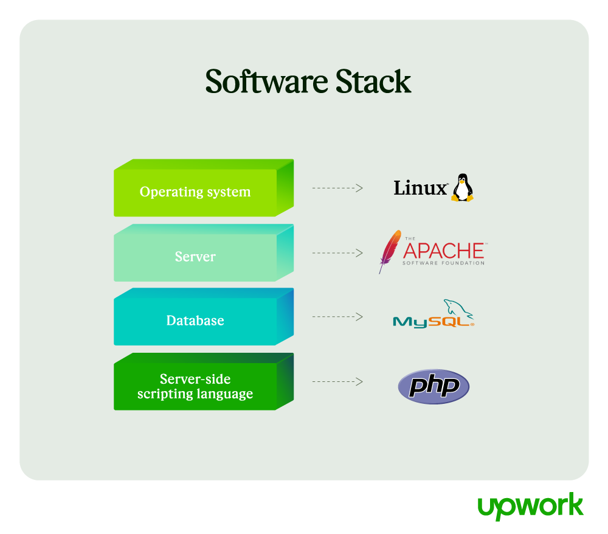

1. **REST API as a Bridge:**
   - Yes, a REST API typically acts as a bridge between the front end and the back end in modern web applications. It provides a standardized way for the front end (in your case, React) to communicate with the back end (Node.js with Express) by defining a set of endpoints (routes) for performing various operations (GET, POST, PUT, DELETE).

2. **Differences between Express and MAMP (PHP/MySQL):**
   - Express is a Node.js web framework, while MAMP is a solution stack(software stack) commonly used for PHP/MySQL development. The key differences include:
     - **Technology Stack:** Express uses Node.js as its runtime, while MAMP typically uses Apache as a web server for serving PHP files.
     - **Programming Language:** Express is JavaScript, while MAMP involves PHP for server-side scripting.
     - **Database Handling:** In MAMP, PHP scripts can connect directly to MySQL databases. In the Express example you provided, it returns JSON data but doesn't interact with a database directly. You'd need to add database connectivity to handle data in Express.

3. **Creating REST API with Express before Prisma:**
   - Yes, typically, you would create the REST API using Node.js and Express first. This API defines the endpoints and routes that your front-end (React) can call to interact with your back-end. Prisma, on the other hand, is used within the back end to interact with the database. The API built with Express connects to Prisma to perform database operations.

4. **Using a Specific Structure for Database Access:**
   - In Node.js and Express, using a structured approach like Prisma is recommended for a few reasons. It provides a type-safe, organized way to interact with databases, and it generates efficient SQL queries automatically. While you could open a raw database connection without a library, this can lead to issues like SQL injection and less maintainable code. Prisma simplifies database access and enhances security.

5. **GET and POST in PHP vs. REST API:**
   - In both PHP (with HTML forms) and REST APIs, GET and POST are HTTP methods used to send data between a client and a server. However, the way they are used can differ:
     - In PHP, GET and POST are often used with HTML forms for client-server communication.
     - In a REST API, GET and POST are used to retrieve and create resources (data) on the server, respectively. They are part of a structured API design for accessing and modifying data.

6. **PHP Architecture vs. Node/React:**
   - PHP traditionally allows for more server-side rendering and mixing of front-end and back-end code in the same file. This approach can be convenient but may not be as modular or scalable as separating front-end (e.g., HTML, CSS, JavaScript) and back-end logic (PHP) into different files or even different technologies.
   - Node.js and React, on the other hand, encourage a more modular and separated approach, making it easier to maintain and scale applications. Node handles server-side logic, while React focuses on the front end. This separation can lead to cleaner and more maintainable code in larger applications.

Each technology and approach has its strengths and use cases, and the choice depends on the specific requirements of your project and your development style.